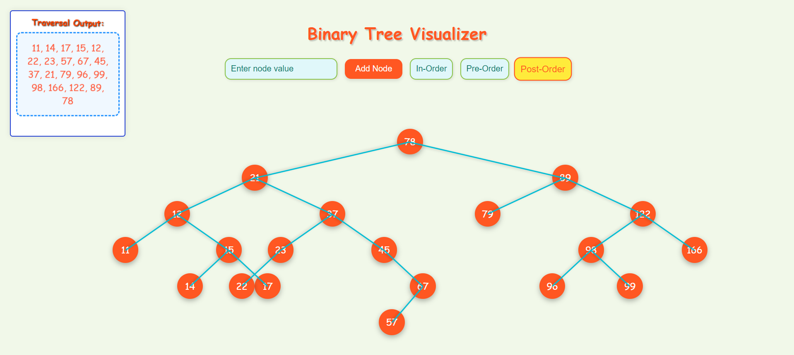

# Binary Tree Visualizer

This project provides an interactive **Binary Tree Visualizer** where users can dynamically add nodes and view the tree structure in various traversal orders. The visualizer uses **JavaScript, HTML, and CSS** to create and manipulate the tree and its elements.

## Live Demo

[Check out the live demo here!](https://binarytreevisual.netlify.app/)



## Table of Contents

1. [Overview](#overview)
2. [Features](#features)
3. [Getting Started](#getting-started)
4. [Usage](#usage)
5. [Code Breakdown](#code-breakdown)
6. [Customization](#customization)
7. [Technologies](#technologies)

## Overview

This visualizer offers a user-friendly interface to create and explore a **Binary Tree**. The tree is represented graphically using nodes and connecting lines, allowing the user to see how nodes are inserted and how the tree is structured.

The tree supports **In-order**, **Pre-order**, and **Post-order** traversal methods, which can be triggered by the user via simple buttons.

## Features

- **Add Nodes:** Add a new node to the tree by entering a value in the input field.
- **Traverse the Tree:** Visualize the tree using in-order, pre-order, and post-order traversals.
- **Animated Elements:** Nodes bounce into place when added, and lines are drawn smoothly between them.
- **Playful UI:** The interface is designed to be interactive and visually engaging, making the tree structure easy to understand.

## Getting Started

### Prerequisites

You only need a modern web browser to run the Binary Tree Visualizer. No additional installations are required.

### Installation

1. **Clone or Download the Repository:**
   - Clone the repository:
     ```bash
     git clone https://github.com/MANASA-REDDY04/BinaryTreeVisualizer.git
     ```
   - Or download the zip file and extract it.

2. **Open `index.html`:**
   - After cloning or extracting the files, open the `index.html` file in your preferred browser.

## Usage

1. **Enter a Node Value:** 
   - In the input box, enter the value of the node you'd like to add.
   
2. **Click 'Add Node':** 
   - The node will appear on the screen, and the tree will automatically adjust itself.

3. **Traversal Methods:**
   - Click the **In-Order**, **Pre-Order**, or **Post-Order** buttons to visualize the corresponding traversal.
   - The result of the traversal is shown in the **Traversal Output** box.

### Example

To create the tree structure in the image above, add the nodes in this order: `78, 21, 37, 45, 17, 22, 96, 166, 11, 23, 122`.

Then, choose a traversal method to see how the tree is navigated.

## Code Breakdown

### 1. **HTML Structure**

The main structure of the visualizer is created using basic HTML elements:

- **Input Field and Buttons:** 
  ```html
  <input type="text" id="nodeValue" placeholder="Enter node value">
  <button id="addNodeButton">Add Node</button>
  <button id="inOrderButton">In-Order</button>
  <button id="preOrderButton">Pre-Order</button>
  <button id="postOrderButton">Post-Order</button>
  ```

- **Traversal Output Box:**
  ```html
  <div id="traversalOutput"></div>
  ```

### 2. **CSS for Styling and Animation**

Playful styles are applied to both the nodes and lines to make the interface engaging:

- **Node Styling:**
  ```css
  .node {
    background-color: #ff5722;
    border-radius: 50%;
    animation: bounceIn 0.5s ease-out;
    /* More styles... */
  }
  ```

- **Line Styling:**
  ```css
  .line {
    background-color: #00bcd4;
    transition: width 1s ease;
    /* More styles... */
  }
  ```

- **Animations:** Nodes bounce into place when added using the following keyframe animation:
  ```css
  @keyframes bounceIn {
    0% { transform: scale(0.1); opacity: 0; }
    60% { transform: scale(1.2); opacity: 1; }
    100% { transform: scale(1); }
  }
  ```

### 3. **JavaScript Logic**

The logic for adding nodes, drawing lines, and handling tree traversals is implemented in JavaScript:

- **Binary Tree Construction:**
  - Nodes are added to the tree in a binary search pattern.
  - Each node is represented visually with a circle, and lines are drawn between parent and child nodes.

- **Traversal Methods:**
  - The tree supports **in-order**, **pre-order**, and **post-order** traversal, and the result is displayed in the output box.

- **Node Creation Example:**
  ```javascript
  function createNode(value, x, y) {
    const nodeElement = document.createElement('div');
    nodeElement.classList.add('node');
    nodeElement.innerText = value;
    nodeElement.style.left = `${x}px`;
    nodeElement.style.top = `${y}px`;
    document.body.appendChild(nodeElement);
  }
  ```

- **Line Drawing Example:**
  ```javascript
  function drawLine(startX, startY, endX, endY) {
    const lineElement = document.createElement('div');
    lineElement.classList.add('line');
    // Set position and transform logic...
    document.body.appendChild(lineElement);
  }
  ```

## Customization

You can easily customize the visualizer by modifying the following:

1. **Node Styles:**
   - Change the background color, size, or border-radius to achieve different styles.
   
2. **Line Colors:**
   - Adjust the color or thickness of the lines by modifying the `.line` class in CSS.

3. **Animation Speed:**
   - Modify the `animation` properties in CSS to control how fast nodes bounce into place.

## Technologies

- **HTML** for structure
- **CSS** for styling and animations
- **JavaScript** for logic and interactivity
